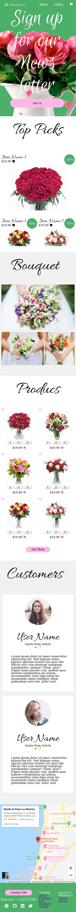

# Florist eShop - Responsive Site

>  Welcome to my first HTML CSS/SASS project. I will be using a pre-processor to edit a custom grid layout for a florist shop. Site is mobile friendly so feel free to use and even improve.

Additional description about the project and its features.

## Built With

- HTML,
- CSS,
- Sass,

## Live Demo

https://raw.githack.com/rootDEV2990/FloristShop/master/index.html

## Getting Started

Simply download the zip and decompress. Once decompressed, double click or open index.html in any web browser. 

To get a local copy up and running follow these simple example steps.

### Prerequisites

Any web browser will do, Mozilla, Safari, or Chrome. 

### Setup

To edit, you will need to install the Sass preprocessor to complie CSS. 

### Install

Sass for Cli. run sass style.sass style.css in terminal to complie within sass dir.  

### Usage

Microverse Curriculum. 

### Run tests

Text editor, web browser, Sass precompiler.

### Deployment

Localhost. 

## Authors

👤 **Miguel Angel Enciso Sanchez**

- Github: [@rootDEV2990](https://github.com/rootDEV2990)
- Twitter: [@m29902](https://twitter.com/m29902)
- Linkedin: [linkedin](https://www.linkedin.com/in/miguel-enciso-6474741a1/)

## 🤝 Contributing

Contributions, issues and feature requests are welcome!

Feel free to check the [issues page](issues/).

## Show your support

Give a ⭐️ if you like this project!

Bitcoin donations accepted ;)

 
## 📝 License

This project is for microverse course purposes.
